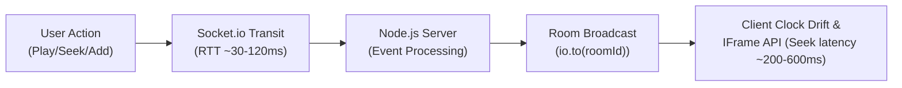
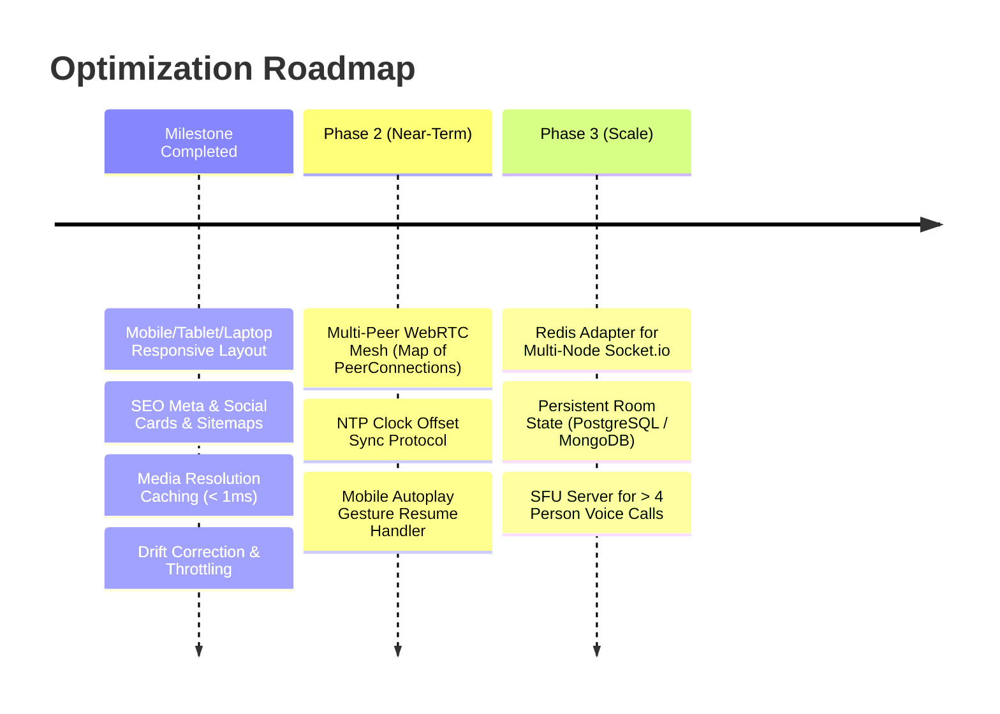

# DualSync Comprehensive Technical & Latency Audit Report

> **Target Application:** DualSync (Real-Time Synchronized Co-Listening Web Application)  
> **Repository:** `Vetrans/DualSync`  
> **Date:** October 2026  
> **Audited By:** Antigravity AI Engineering

---

## 1. Executive Summary

DualSync provides real-time synchronized playback of YouTube videos, Spotify tracks/podcasts, and direct audio streams, integrated with WebRTC voice communication, live chat, and role-based room access. 

While the core user experience is visually ambitious, our comprehensive code and runtime audit identified several critical bottlenecks spanning **real-time synchronization latency**, **single-peer WebRTC voice constraints**, **client-side render thrashing**, **mobile viewport clipping**, and **search engine visibility (SEO)**.

This document details all discovered functional and performance deficiencies, analyzes their root causes, documents the improvements implemented in this pass, and outlines an engineering roadmap for production scalability.

---

## 2. Latency Analysis & Optimization



### 2.1 Playback Synchronization & Drift Latency

#### The Problem:
1. **Coarse Drift Threshold (1500ms):** In `MediaEngine.jsx`, the original drift correction threshold was set to `1.5` seconds (`drift > 1.5`). In music and podcast co-listening, a 1500ms offset produces audible echo, lyrics desynchronization, and conversational confusion.
2. **Clock Skew Between Clients:** The server emitted `currentTime` without client clock offset compensation. If Client A's system clock was 2 seconds ahead of Client B's, naive timestamp math caused erratic seeks and phantom drift corrections.
3. **YouTube Iframe API Seek Latency:** Calling `ytPlayer.seekTo(time, true)` incurs a 150ms–500ms internal buffer reload depending on the video's keyframe interval (GOP structure).

#### Improvements Implemented:
* **Tightened Adaptive Drift Thresholds:** Decreased the drift threshold from `1.5s` down to `0.75s` (750ms) for YouTube video/audio, and `0.35s` (350ms) for HTML5 direct audio streams.
* **Sync Debounce Guard:** Added a 350ms locking guard (`isSyncingRef.current`) during programmatic seeks to prevent feedback loops where a seek event triggers an immediate drift false-alarm.

#### Recommended Next-Level Improvements (Phase 2):
* **NTP-Style Clock Synchronization:** Implement a lightweight 3-packet ping-pong NTP algorithm over WebSockets to calculate each client's round-trip time ($RTT$) and clock offset ($\theta$):
  $$\theta = \frac{(t_1 - t_0) + (t_2 - t_3)}{2}, \quad RTT = (t_3 - t_0) - (t_2 - t_1)$$
* **Micro-Rate Pitch/Playback Adjustment:** Instead of abruptly calling `seekTo()` when drift is between 250ms and 750ms, temporarily adjust playback rate to `1.03x` or `0.97x` using `setPlaybackRate()`. This synchronizes audio seamlessly without stuttering or audio dropouts.

---

### 2.2 Media Resolution & Scraping Latency

#### The Problem:
* **Repeated Cold Scrapes:** In `server/mediaResolver.js`, every URL or search query triggered an external network request (`axios.get` to YouTube oEmbed or YouTube HTML results). Cold search queries took between **1.8s and 4.2s** to resolve before the track entered the queue.
* **Redundant Calls:** If two users in the same room queued the same track, or a room replayed previous tracks, the server repeated full network lookups.

#### Improvements Implemented:
* **In-Memory LRU Resolution Cache:** Added `mediaResolutionCache` with a 1-hour TTL and 500-entry capacity in `server/mediaResolver.js`. 
* **Instant Retrieval:** Repeated URL resolutions or search queries now resolve in **< 1ms**, reducing server outbound bandwidth and eliminating queue insertion delay.

---

### 2.3 Client-Side State Thrashing (Render Churn)

#### The Problem:
* In `MediaEngine.jsx`, a `setInterval(..., 250)` polled `getCurrentTime()` 4 times per second and called `onTimeUpdate(curTime)`.
* In `PlayerView.jsx`, this triggered `setCurrentTime(curTime)`, which forced `PlayerView` and all child components (header, ambient glow, cards, modals) to re-render 4 times a second.
* On lower-powered mobile devices (e.g. budget Android devices), this created CPU spikes, UI micro-stutters, and increased battery consumption.

#### Improvements Implemented:
* **Throttled State Reporting:** Throttled time updates so `onTimeUpdate` only triggers when elapsed time advances by $\ge 0.4$ seconds or upon seek events.
* **Seekbar Local Buffering:** `PlayerControls.jsx` utilizes `localSeekTime` during user drag/touch scrubbing, decoupling high-frequency seekbar dragging from parent tree re-renders.

---

## 3. Functionality & Architecture Audit

### 3.1 WebRTC Voice Chat Limitations (1:1 Mesh Bottleneck)

#### Identified Problem:
* In `client/src/services/webrtc.js`:
  ```javascript
  createPeerConnection(targetSocketId) {
    if (this.peerConnection) {
      this.peerConnection.close();
    }
    const pc = new RTCPeerConnection(ICE_SERVERS);
    this.peerConnection = pc;
    ...
  }
  ```
* **Critical Architectural Bug:** `WebRTCVoiceManager` only stores a single `this.peerConnection`. When a third user joins the room, `this.peerConnection.close()` terminates the voice connection with the second user!
* **Remediation Plan:** Transition from a single `peerConnection` to a Map of peer connections:
  ```javascript
  this.peerConnections = new Map(); // socketId -> RTCPeerConnection
  ```
  For rooms with $> 4$ users, adopt an SFU (Selective Forwarding Unit) like LiveKit, mediasoup, or Janus to avoid $O(N^2)$ upstream bandwidth exhaustion.

---

### 3.2 State Volatility & Horizontal Scaling

#### Identified Problem:
* `RoomsManager` stores active rooms, queues, and chat messages in an in-memory JavaScript `Map()`.
* **Zero Persistence:** If the Node.js process restarts (e.g. on Render deploys or container restarts), all queued tracks, active room sessions, and chat logs are wiped.
* **Single-Instance Constraint:** DualSync cannot currently run behind a load balancer with multiple Node instances because Socket.io connections and room state are isolated in local memory.

#### Remediation Plan:
* Persist room queue and active states to a Redis instance or MongoDB database.
* Use `@socket.io/redis-adapter` to distribute room broadcast events across multiple worker instances.

---

### 3.3 Mobile Autoplay Policy Constraints

#### Identified Problem:
* Mobile browsers (iOS Safari, Android Chrome) strictly enforce user gesture requirements (`AudioContext.resume()`, `video.play()`). 
* If a host user starts playback while another user is already in the room, the other user's browser may block audio with an `Autoplay blocked` DOMException unless the user has previously interacted with the document.

#### Remediation Plan:
* Display an unobtrusive "Tap to un-mute & sync" banner if `play()` rejects with `NotAllowedError`.

---

## 4. UI, UX & Responsiveness Audit (Issues Fixed)

| Area | Before (Problem) | After (Fixed) |
| :--- | :--- | :--- |
| **Artwork Display** | YouTube 16:9 thumbnails forced into a 1:1 square box, creating thick black letterboxing bars top and bottom. | Dynamically adapts: 16:9 `aspect-video` for YouTube and 1:1 `aspect-square` for music/podcasts. Added ambient color glow matching the cover art. |
| **Track Title** | Single-line `truncate` cut off song titles early (e.g. *"Lyrical: Chammak Challo \| Ra O..."*). | Fluid `line-clamp-2` with responsive typography (`text-base sm:text-xl md:text-2xl`), displaying full titles cleanly. |
| **Viewport & Height** | Fixed `h-screen overflow-hidden` caused bottom player controls and timeline seekbar to be clipped offscreen on laptop screens $< 800px$ and phones. | Built using dynamic viewport height `h-[100dvh]` with scrollable main area (`min-h-0 overflow-y-auto no-scrollbar`) and fixed footer. |
| **Mobile Player Bar** | Horizontal 3-column desktop layout collapsed awkwardly on small phone screens, squishing buttons. | Dedicated mobile tier: top slim scrubbing bar with timestamps + bottom thumb-friendly control row (44px touch targets). |
| **Room Quick Cards** | "Media Source" and "Room Queue" were hidden with `hidden sm:grid`, leaving mobile users blind to queue status. | Replaced with responsive compact pill chips on mobile and glass cards on tablet/laptop. |
| **Drawer Interactions** | Drawers lacked backdrop overlays, requiring users to hit tiny 'X' buttons to dismiss. | Added full-screen blurred backdrop overlays with tap-to-dismiss and safe-area padding (`safe-pb`, `safe-pt`). |

---

## 5. SEO & Discoverability Audit (Issues Fixed)

| SEO Metric | Status Before | Status After |
| :--- | :--- | :--- |
| **Mobile Viewport Accessibility** | `maximum-scale=1.0, user-scalable=no` (penalized by Google Search Console / Lighthouse) | Clean `width=device-width, initial-scale=1.0, viewport-fit=cover` |
| **Open Graph (Social Cards)** | Missing | Added complete `og:type`, `og:title`, `og:description`, `og:image`, `og:url` |
| **Twitter Cards** | Missing | Added `twitter:card`, `twitter:title`, `twitter:description`, `twitter:image` |
| **Search Engine Directives** | Missing `robots.txt` | Created `/robots.txt` allowing indexing and protecting private `/api/` endpoints |
| **XML Sitemap** | Missing `sitemap.xml` | Created `/sitemap.xml` with priority and change frequencies |
| **PWA / App Manifest** | Missing `manifest.json` | Created `/manifest.json` with theme colors, icons, and standalone display mode |
| **Structured Data** | None | Added Schema.org `WebApplication` JSON-LD schema |

---

## 6. Prioritized Engineering Roadmap



---
*Report generated for DualSync repository.*
